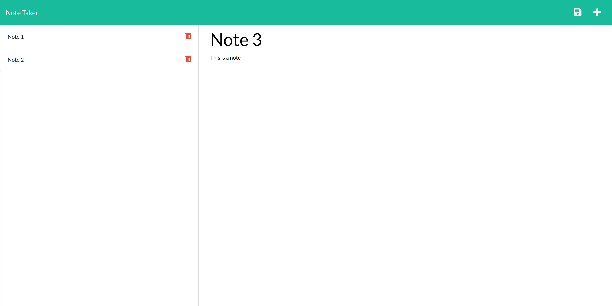

# note-taker

## Description

**Goal**: To use Express.js to connect back-end and front-end to create a functional notes application.

In today's world, there is a lot to keep track of. This application was designed to write, retrieve, and delete notes to help users keep track of their tasks and organize their thoughts.

## Tech Stack

- HTML
- CSS
- JavaScript
- JSON
- Node.js
- npm
- Express
- fs
- util?
- uniqid

## Development

1. Create repository and import starter files
1. Download npm dependencies
1. Initialize port, write middleware for requests, and add a port listener
1. Write HTML routes
1. Write API routes
1. Implement functions to read, write, and edit database file

## Deployment

[Link to deployed application](https://note-taker-ssharma.herokuapp.com/)